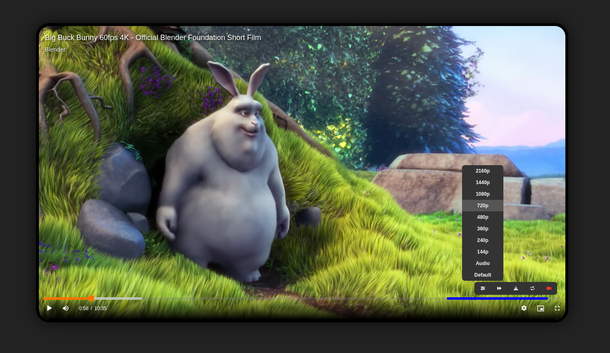
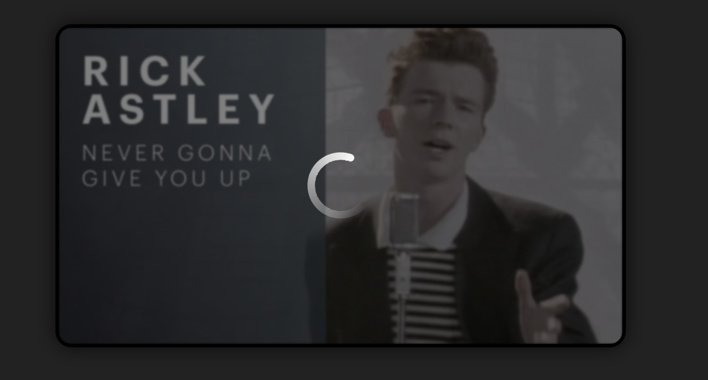
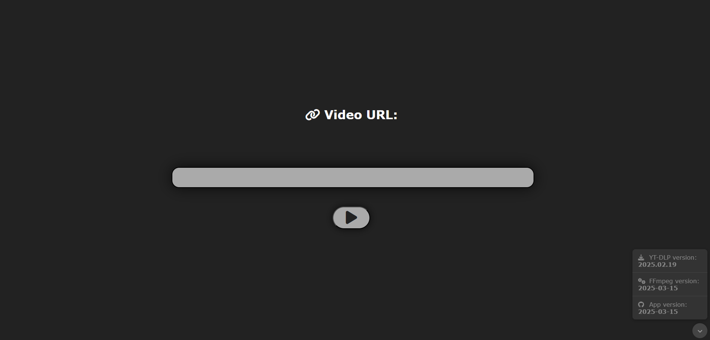
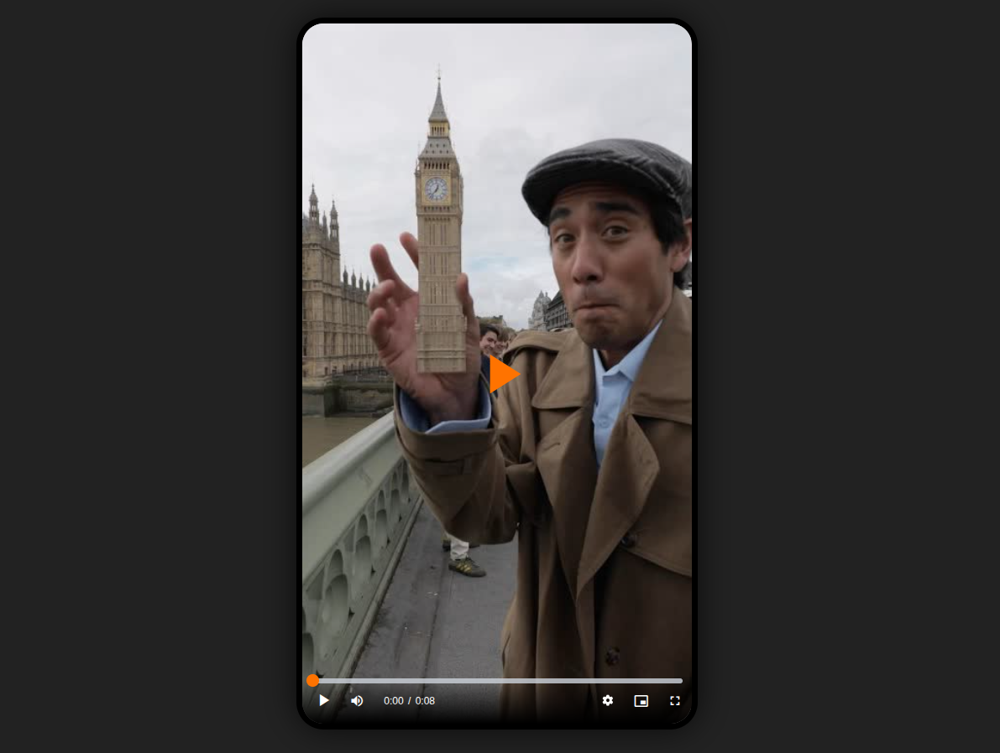

# YT-DLP Web Player
### Arbitraty internet video player powered by yt-dlp

<p align="center">
  
</p>

## Features
- videojs usage to support custom video elements
- yt-dlp used for video download
- ffmpeg for better format support
- implemented sponsorblock for supported sites (currently YouTube)
- PWA support with "share with" target for Android
- Media Session API integration for system playback controls
- nice animations while loading video
- video download option
- video format selection
- closed captions support
- HLS support for shorter load times and better performance (experimental)
- Player embedding using `/iframe` endpoint (experimental)
- configurable themes

**Daily auto update of yt-dlp to immediately support new yt-dlp codecs and sites**

## Planned
- livestream support
- more QoL features

## Images







# Installation

```yml
services:
    ytdlp_web_player:
        # build: .
        image: matszwe02/ytdlp_web_player
        restart: unless-stopped
        environment:
            - APP_TITLE=YT-DLP Player
            - THEME_COLOR=#ff7300
            - GENERATE_SPRITE_BELOW=1800 # video length in seconds
            - AMOLED_BG=false
        ports:
            - 5000:5000

```