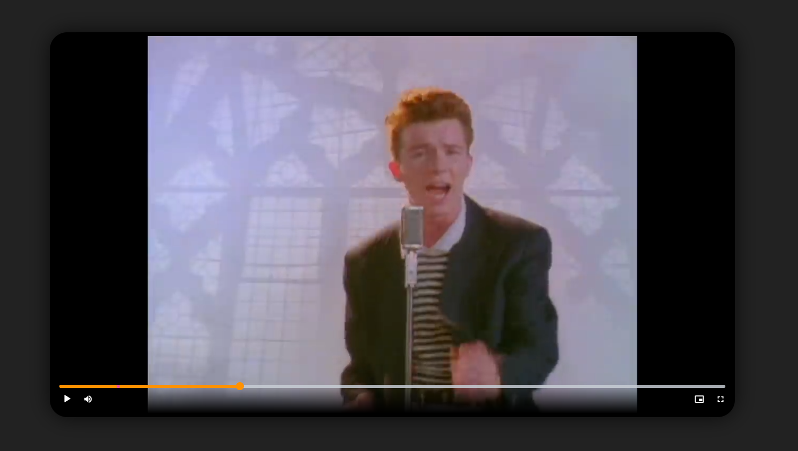

# Arbitraty internet video player powered by yt-dlp

## Features
- videojs usage to support custom video elements
- yt-dlp used for video download
- ffmpeg for better format selection
- implemented sponsorblock for supported sites (currently YouTube)
- PWA support with "share with" target for Android
- nice animations while loading video
- video download option
- video format selection (default is 720p)
- closed captions support

**Daily auto update of yt-dlp and ffmpeg to immediately support new yt-dlp codecs and sites**

## Planned
- HLS support for shorter load times and livestream support
  - Since version `2026-02-03` experimental HLS support can be enabled from the video menu
- Player embedding

## Images




# Installation

```yml
services:
    ytdlp_web_player:
        # build: .
        image: matszwe02/ytdlp_web_player
        restart: unless-stopped
        environment:
            - APP_TITLE=YT-DLP Player
            - THEME_COLOR=#ff7300
            - ENABLE_SPRITE=true
            - AMOLED_BG=false
        ports:
            - 5000:5000

```